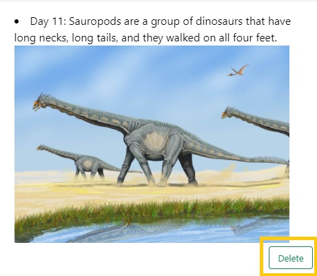

# AdventCalendar 

An e-advent calender for Dec. 2021. The one I made is Dinosaur theme containing facts, images and links for dinosaur related things.  

Check it out: <a href="https://dry-lake-20084.herokuapp.com" target="_blank">Dinosaur Dec. 2021 Advent Calendar</a>

I also made version without a database back in Dec. 2020:  <a href="https://mhvue.github.io/dinosaurAdventCalendar" target="_blank">Dinosaur Dec. 2020 Advent Calendar</a>.  Check out that repository here: <a href="https://github.com/mhvue/dinosaurAdventCalendar" target="_blank">here</a>. 
Eventually, I want to implement the same features such as not being able to click ahead. Play around with this one to see the slight differences. 

## How It Works: 
Click on any day to reveal a fun fact about dinosaurs. Here I clicked on Day 8. 

You'll see a "Like This" button. Click on it to add this fact a list of likes.  

You'll know it got added to Your Likes when the text on button changes to "Added to your likes!"

To view your likes, there is a View Likes button. Click on this button to see all your likes.

Here is all your likes.

If you no longer like a fact from your list of likes, just click on Delete to delete it from your list. 

If you accidentally clicked on a non-numbered area on calendar, it will show you a message 

## What you will need: 
* This is for those who are have some knowledge in programming. You will need to be able to add your own information in a database via the seeder files in this project. 
* You will need MySql Workbench.
* Knowledge how to deploy to heroku. If you need help, try this: https://www.youtube.com/watch?v=AQp7b-1356k 
* Once deployed successfully to Heroku, you will neeed to seed your database. Watch this video on how to do that: https://www.youtube.com/watch?v=y7YwSIMLggo 

## Build with: 
* Bootstrap
* HTML
* CSS 
* Javascript (jQuery)
* Sequelize 
* Node
* Express 
* MySQL

## TO DO as of 9/10/2021
* make it mobile friendly 

